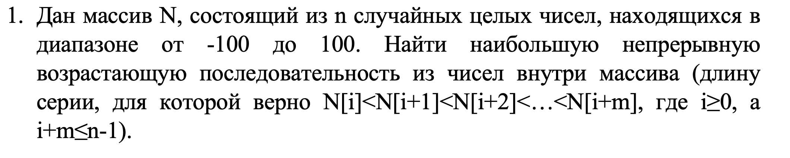
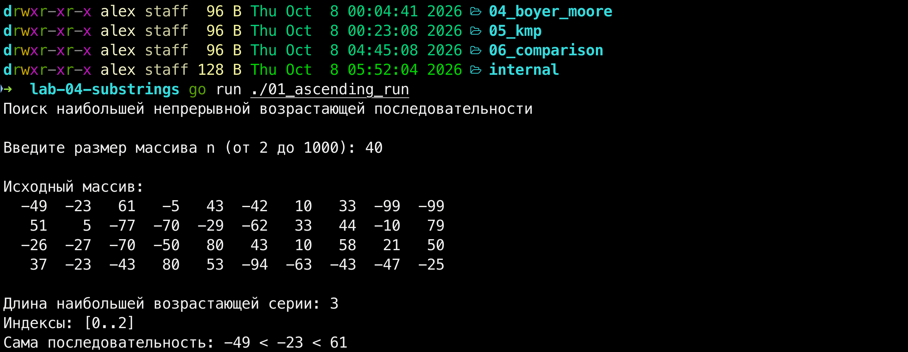
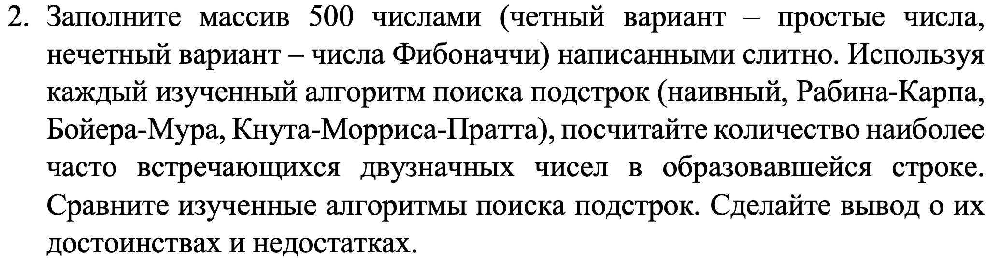
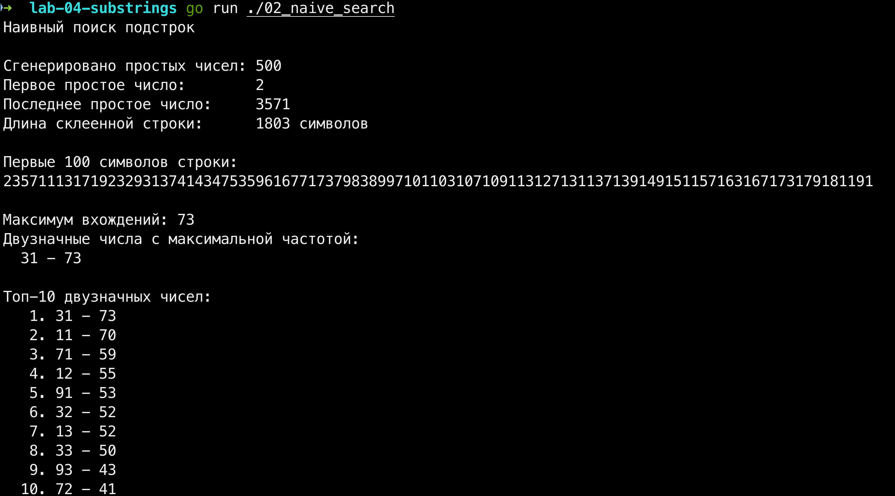
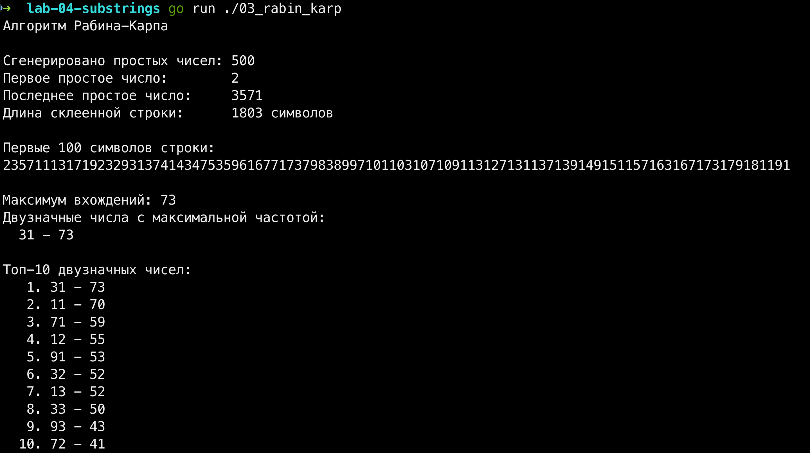
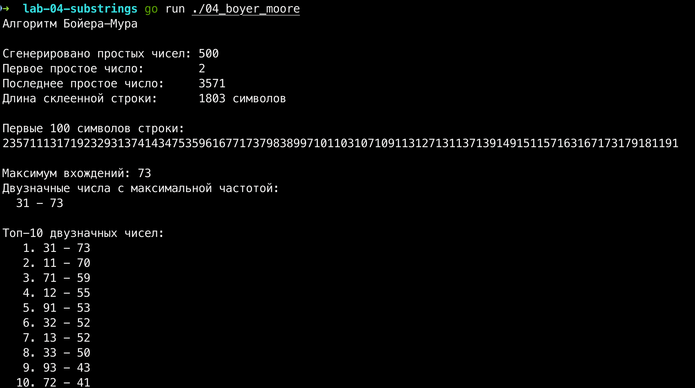
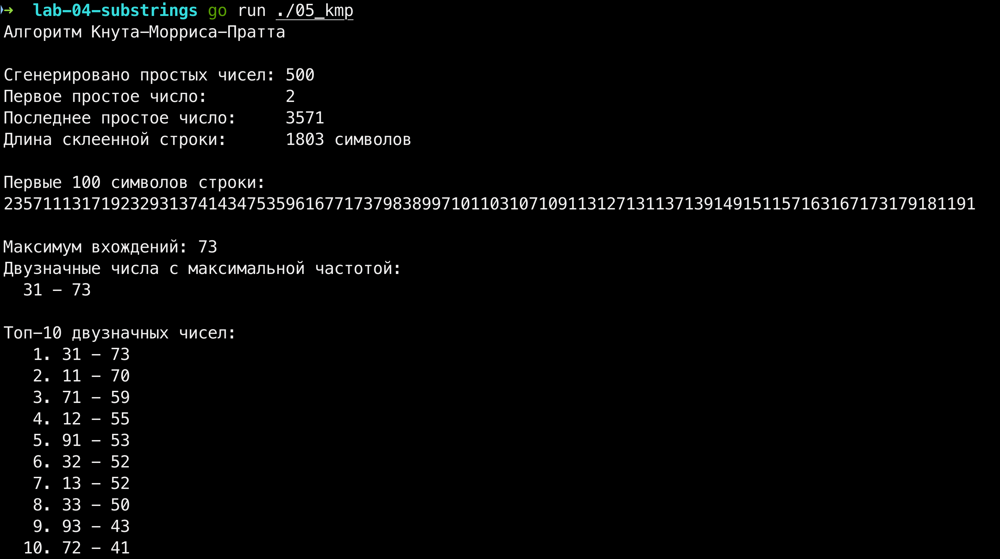
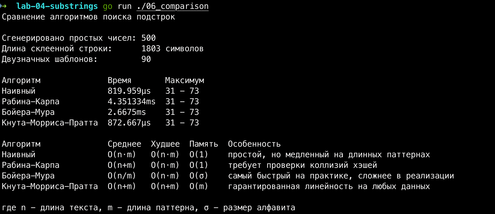

# Лабораторная работа №4. Алгоритмы поиска подстрок

## Введение

Тема этой работы - поиск подстрок. В бэкенде она встречается буквально на каждом шагу: поиск по логам, валидация пользовательского ввода, парсинг текстовых протоколов, и т.п. Если запустить наивный алгоритм на гигабайтах логов, сервер ляжет за секунды, поэтому важно понимать, какой из четырёх классических алгоритмов когда применять.

В работе две задачи.

1. Найти в массиве случайных чисел самую длинную непрерывную возрастающую серию. 2. Сенерировать 500 простых чисел, склеить их в одну строку и подсчитать, какие двузначные числа в ней встречаются чаще всего. Для этого применяю четыре алгоритма: наивный, Рабина-Карпа, Бойера-Мура и Кнута-Морриса-Пратта

В конце буду сравнивать по сложности и скорости.

Весь код лежит реализован на Go.
Общие алгоритмы вынесены в пакет `internal/algo`, печать отчётов в `internal/report`, каждый main-файл это тонкая обёртка из трёх строк. Это убирает дублирование и повторяет подход обычных проектов на Go.

## 1 Основное задание

### 1.1 Задание 1. Наибольшая возрастающая серия

**Условие:**

**Решение.** Задача решается за один линейный проход, сложность O(n). Быстрее не получится, надо посмотреть каждый элемент! Завожу два счётчика: длину текущей серии и длину максимальной, плюс храню границы лучшей серии, чтобы в конце вывести сами числа, а не только их количество.

Цикл идёт по массиву и сравнивает каждый элемент с предыдущим.
Текущий больше - серия продолжается. Нет, серия оборвалась, сравниваю с максимальной и сбрасываю счётчик. В конце обязательно проверяю `хвост массива`: если последняя серия оказалась самой длинной, цикл об этом ещё не знает, потому что обрыв происходит только на следующей итерации.

Размер массива вводится через консоль с валидацией, программа не падает ни от буквы вместо числа, ни от пустой строки.

**Код:**
[01_ascending_run/main.go](01_ascending_run/main.go)

**Вывод в терминале:**

Массив из 40 чисел, найдена серия из 3 элементов на индексах [0..2]: -49 < -23 < 61. Первая тройка оказалась самой длинной возрастающей цепочкой подряд.

### 1.2 Задание 2. Четыре алгоритма поиска подстрок

**Условие.**

**Решение.** Моя группа К4112с заканчивается на 2, поэтому чётный вариант, беру простые числа. Генерирую их методом пробного деления: для каждого кандидата проверяю делимость только на уже найденные простые до корня из него. Для 500 чисел работает мгновенно.

Дальше склеиваю все числа в одну строку через `strings.Builder` - конкатенация через `+` на 500 итерациях заметно медленнее. Получается строка длиной 1803 символа, начинается так: `2357111317192329313741434753596167717379838997101103...`

Теперь для каждого двузначного числа от 10 до 99 (всего 90 паттернов) считаю, сколько раз оно встречается в этой строке. Одинаковый вход, одинаковая логика подсчёта, меняется только функция поиска - идеальная задача для сравнения четырёх алгоритмов.

#### 1.2.1 Наивный поиск

Прямое последовательное сравнение, прикладываю шаблон к каждой позиции текста и сравниваю символы по элементам. Совпало, значит нашли. Нет, сдвигаю шаблон на одну позицию и повторяю. Сложность O(n \* m), память O(1) - всего пара переменных, никаких дополнительных структур.

**Код:**
[02_naive_search/main.go](02_naive_search/main.go)

**Вывод в терминале:**

Число 31 встречается 73 раза - это максимум. Топ-10 укладывается в диапазон 41-73 вхождений.

#### 1.2.2 Алгоритм Рабина-Карпа

Ускоряю наивный алгоритм за счёт хэш-функции. Считаю полиномиальный хэш шаблона один раз, потом для каждого окна текста пересчитываю хэш за O(1) - вычитаю уходящий символ, добавляю новый. Если хэши совпали, делаю посимвольную проверку, чтобы не обмануться на коллизии. Сложность O(n + m) в среднем, память O(1).

**Код:**
[03_rabin_karp/main.go](03_rabin_karp/main.go)

**Вывод в терминале:**

Ответ тот же - 31 встречается 73 раза. Все четыре алгоритма дают одинаковый результат, потому что решают одну задачу. Разница только во времени.

#### 1.2.3 Алгоритм Бойера-Мура

Сравнение идёт справа налево. Если символ не совпал, проверяю (тоже справа налево), есть ли этот символ где-то ещё в шаблоне. Если есть, то сдвигаю до совпадающего символа. Если нет - сдвигаю на всю длину шаблона. Это эвристика плохого символа. Сложность O(n / m) в лучшем случае, память O(m) из-за таблицы последних вхождений.

**Код:**
[04_boyer_moore/main.go](04_boyer_moore/main.go)

**Вывод в терминале:**

Результат снова 73 вхождения числа 31. Но на коротком паттерне длины 2 этот алгоритм работает медленнее наивного, эвристика не успевает раскрыться.

#### 1.2.4 Алгоритм Кнута-Морриса-Пратта

Единственный алгоритм с гарантированной линейной сложностью O(n + m). Заранее строю префикс-функцию, таблицу, которая для каждой позиции шаблона говорит, куда откатиться внутри шаблона при несовпадении. Указатель по тексту идёт строго слева направо и никогда не откатывается. Память O(m) - нужно хранить массив длины шаблона.

**Код:**
[05_kmp/main.go](05_kmp/main.go)

**Вывод в терминале:**

Ответ традиционный и это 31 встречается 73 раза. КМП единственный даёт линейность на любых данных, включая «злые» случаи, где наивный алгоритм деградирует до O(n \* m).

### 1.3 Задание 3. Сравнение алгоритмов

**Условие.** Сравнить изученные алгоритмы поиска подстрок, сделать вывод об их достоинствах и недостатках.

**Решение.** Все четыре алгоритма собраны в одном стенде, прогоняю каждый по одной и той же строке с замером времени. Одинаковый вход, одинаковый выход, разница только во времени...

**Код:**
[06_comparison/main.go](06_comparison/main.go)

**Вывод в терминале:**

По результатам: наивный - 819 мкс, КМП - 872 мкс, а `Рабина-Карпа` и `Бойера-Мура` оказались `медленнее в 3-5 раз (4.35 мс и 2.66 мс)`. На первый взгляд неожиданно, но объяснимо.

Паттерн короткий - всего 2 символа. Для такой длины накладные расходы алгоритмов превышают всю выгоду от их теоретической эффективности. Рабина-Карпа делает модульную арифметику на каждой позиции это дороже, чем сравнить два символа напрямую. Бойер-Мура использует map для таблицы плохих символов, `а при m = 2 сдвиг получается максимум на 1`, так что преимущество не реализуется.

На длинных данных картина меняется радикально. `Если бы паттерн был длиной 20-50 символов`, а текст - миллион, Бойер-Мур обогнал бы всех за счёт больших сдвигов. КМП выигрывает там, где данные могут быть `злыми`. Рабина-Карпа незаменим, когда нужно искать сразу много паттернов одинаковой длины - хэши считаются один раз.

Универсального лучшего алгоритма нет! Та же история, что и с сортировками в третьей лабе. Выбор зависит от задачи:

- гарантированная линейность на любых данных - `КМП`
- максимальная скорость на больших текстах - `Бойер-Мур`
- много паттернов одинаковой длины - `Рабина-Карпа`
- маленький текст и короткий паттерн - `наивный справится не хуже`

## Заключение

Четыре алгоритма, одна задача, четыре разных подхода. Работа показала, что теоретическая сложность это не единственный критерий эффективности, на практике важны `накладные расходы`, `размер паттерна` и `объём текста`. Умение выбирать правильный инструмент под задачу - это и есть инженерное мышление...

## Список использованных источников

1. Документация по языку программирования Go: https://go.dev/doc/
2. Лекция 4: Поиск подстрок, Университет ИТМО.
3. Мусаев А. А., Юсупов Р. М. [Особенности оценивания эффективности информационных систем и технологий, Труды СПИИРАН, 2017](https://www.mathnet.ru/links/d28395407eebe036c6d1e54e27befa49/trspy934.pdf)
